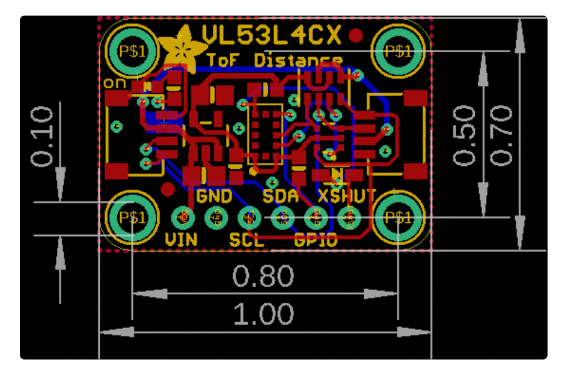
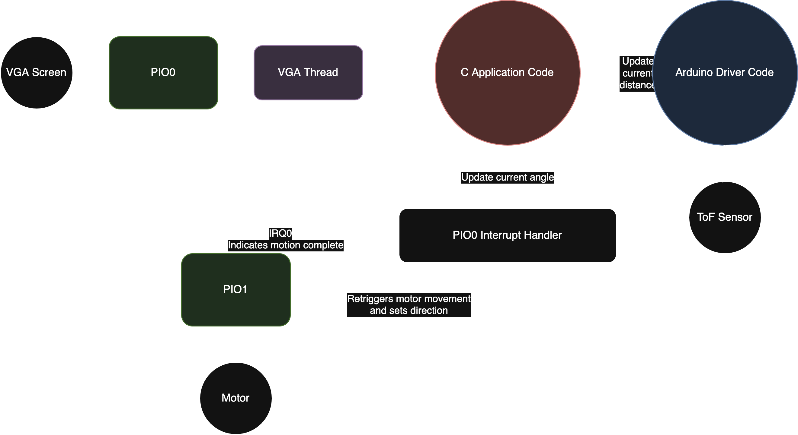
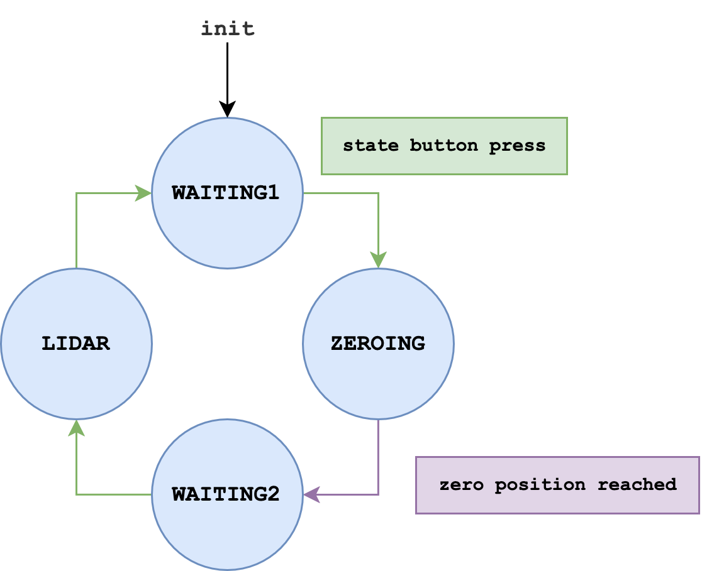
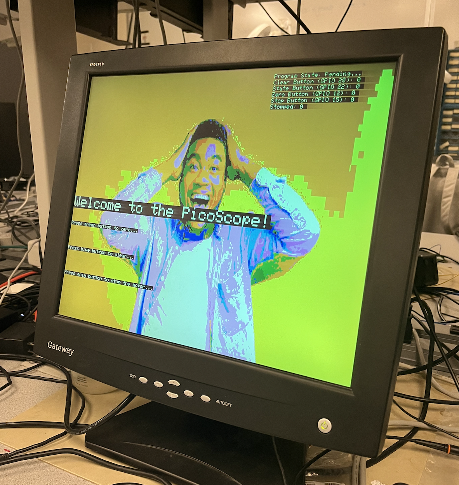

## Project Introduction


The project involves building a 2D lidar system using a
[Raspberry Pi Pico](https://datasheets.raspberrypi.com/pico/pico-datasheet.pdf),
[Adafruit VL53L4CX ToF sensor][tof], and
[28BYJ-48 stepper motor][motor] with a
[ULN2003 Driver][driver]
to capture and process distance measurements for mapping and navigation applications.

### Materials

TODO: check these costs

| Material                           | Purpose                                              | Cost  |
| ---------------------------------- | ---------------------------------------------------- | ----- |
| [Raspberry Pi Pico][pico]          | Microcontroller used to control the LiDAR system     | $4    |
| [Adafruit VL53L4CX][tof]           | Time-of-Flight sensor for distance measurements      | $16   |
| [28BYJ-48 Stepper Motor][motor]    | Provides rotational motion for LiDAR scanning        | $3    |
| [ULN2003 Driver][driver]           | Driver board for controlling the stepper motor       | $2    |
| [Optical Interrupter][interrupter] | Used for zeroing the stepper motor position          | $0.80 |
| [8mm Shaft][shaft]                 | Acts as the rotating structure for the ToF sensor    | $3    |
| [Linear Rail Shaft Guide][mount]   | Acts as mounting point for ToF sensor onto the shaft | $1.90 |
| [LEGOs][lego]                      | Base structure for prototyping the LiDAR system      | $5    |
| [Coupler][coupler]                 | Connects the stepper motor shaft to the 8mm shaft    | $6.99
|
| **Total**                          |                                                      | ~$50  |

[pico]: https://datasheets.raspberrypi.com/pico/pico-datasheet.pdf
[tof]: https://www.adafruit.com/product/5425
[motor]: https://www.mouser.com/datasheet/2/758/stepd-01-data-sheet-1143075.pdf
[driver]: https://www.hadex.cz/spec/m513.pdf
[interrupter]: https://www.amazon.com/dp/B08977QFK5
[coupler]: [https://www.digikey.com/en/products/detail/adafruit-industries-llc/1176/5356856?](https://www.amazon.com/dp/B09954NX1D?ref=ppx_yo2ov_dt_b_fed_asin_title)_gl=1*1fj4v1t*_up*MQ..*_gs*MQ..&gclid=Cj0KCQjwlYHBBhD9ARIsALRu09pQkFZ69vrKAREuje5s0DU45L-u0MY9VR9d4HslId9s2JQaq0RHWlgaAo-VEALw_wcB&gclsrc=aw.ds&gbraid=0AAAAADrbLli0Lcyq9VNl9vfY3Nuxm_SOE
[shaft]: https://www.mcmaster.com/products/shafts/diameter~8-mm/shafts-3~/
[mount]: https://www.amazon.com/Aluminum-Linear-Support-Motion-Diameter/dp/B08JTPG54L?crid=VE5NLH316WIC&dib=eyJ2IjoiMSJ9.8u7yLVsXJBCCXM-_QTPta-R2lmSJKFH-DtzfCBahL9cnmPkF2szSko9g0C1rEBCG6bWblfNmAMwnvw4zKdipPjAAkPqK9mF_uiAwiPyp-3CHeSUozXEmkEz0_U7f2gGTDtdbu5OqW56t3uetVcu8oFVF8yaxu7_8Y5Cf46Fdh_mlrRXYPnfe326K4AS7tn2qRFR2RoI1jNnCYq0fCcVEPHziCsNV_U2Tc7l1DSdM3b0.j-Z2p5phNmA9W1UhB2zbppoalZmnu23CJ87fPc1kSMs&dib_tag=se&keywords=8mm+linear+mount&qid=1747017395&sprefix=8mm+linear+moun%2Caps%2C85&sr=8-3
[lego]: https://www.lego.com/en-us/product/millennium-falcon-75192

TODO: add link for coupler and shaft


---

## High-Level Design

The purpose of this project was to construct a 2-Dimensional LiDAR capable of scanning distances up to approximately 3 meters in distance. The high-level design of the project consisted of a few key components: the mechanical structure upon which the Time-of-Flight sensor was mounted, the software logic for interfacing with a stepper motor for rotating the Time-of-Flight Sensor, Arduino code and UART communication for extracting readings from the sensor, and graphics for visualizing measurements. Additionally, various mechanisms were implemented to allow for sensor calibration, including an optical-interrupter used to provide a reference point for the angle of the stepper motor.

### Time-of-Flight Sensors: Rationale, Background Math, and Project Inspiration

Generally, Time-of-Flight sensors can measure surrounding terrain by emitting photons and sensing the duration of time before photons return back to the sensor. Note that from this point forward Time-of-Flight will be abbreviated with the acronym ToF.

The ToF sensor utilized in the lab employed a wavelength of 940nm, indicating the use of infrared radiation. Infrared radiation is often used for such applications as it is “invisible” and can reduce interference from external light sources. In fact, infrared light is less susceptible to Rayleigh scattering, a well-known phenomenon where small atmospheric particles cause light to scatter. The intensity of Rayleigh scattering is inversely proportional to the wavelength of the scattered light raised to the power of 4
http://hyperphysics.phy-astr.gsu.edu/hbase/atmos/blusky.html
:

$$
\text{Intensity of Scattered Light} \propto \frac{1}{\lambda^4}
$$

Thus, infrared light—specifically at a wavelength of 940 nm—is a suitable choice for a ToF sensor. One can estimate the distance to an object using a simplified formula based on the speed of light:

$$
\text{Distance} \approx \frac{t \cdot c}{2}
$$

where $t$ is the time it takes for a photon to travel to the object and back (time-of-flight), and $c$ is the speed of light. 

Of course, environmental factors can interfere with ToF measurements - aside from light scattering, ambient light sources can emit additional photons that can often interfere with the sensor’s ability to detect surrounding objects. This may explain the phenomenon observed where weaker signals were derived from objects farther away from the sensor. In other words, farther objects increase the chances of environmental interference. Interestingly, the properties of the objects which reflect the emitted IR radiation can also have a significant impact on the quality of ToF measurements. Shiny surfaces, including metals and glass, are often great reflectors of IR radiation. These objects may be easier to detect utilizing the ToF sensor compared to objects that absorb IR radiation, such as objects with dark surfaces.

Finally, the ToF sensor characteristics include physical phenomena crucial for achieving accurate distance measurements. The sensor employs the use of SPADs - Single Photon Avalanche Diodes - to detect reflected light. This type of photodiode is exceedingly useful for detecting photons. When a photon enters the depletion region of the diode, a photogenerated carrier is created. And the strong electric field caused by the reverse-biased diode ensures that the carrier leads to an avalanche of additional carriers via a process called impact ionization - photogenerated carriers get accelerated by the electric field and collide with other bounded carriers, freeing them and creating an avalanche effect.  This avalanche effect allows for amplification of the signal caused by the reflected photon. Below is a diagram illustrating this effect. Note that SPADs operate above the breakdown voltage in the Geiger regime, allowing for the aforementioned "avalanche":


https://opg.optica.org/ao/fulltext.cfm?uri=ao-35-12-1956&id=46631
https://www.sto.nato.int/publications/STO%20Meeting%20Proceedings/STO-MP-IST-SET-198/MP-IST-SET-198-C1-03.pdf


<p align="center">
  <a href="https://www.sto.nato.int/publications/STO%20Meeting%20Proceedings/STO-MP-IST-SET-198/MP-IST-SET-198-C1-03.pdf">
    
  </a>
</p>

The VL53L4CX Time-of-Flight Sensor houses an array of SPADS, utilizing their photodetecting abilities to extract measurements of surrounding terrain.

Thus, despite some challenges, a multitude of physical factors highlights the suitability of a ToF sensor structure for scanning terrain in scientific applications, providing inspiration and a rationale for the PicoScope Project.

### Logical Structure

The logical structure of this project consisted of the development of a few key components, namely the mechanical assembly of the ToF structure, software and hardware logic for interfacing with the sensor and stepper motor, development of the user experience, and graphics for visualizing sensor data/measurements.

Initially software logic for interfacing with the stepper motor via PIO state machines and with the ToF sensor were developed. Using the list of MACROs and functions provided in ECE4760's motor_library.h file, the direction and pace of the motor was continuously updated via an interrupt service routine. Because the interrupt handler was called after the stepper motor executed a command, it was also a suitable function for processing the distance measurements produced by the ToF sensor.

Extraction of ToF sensor measurements on the VL53L5CX was achieved by adapting open-source Arduino libraries for the sensor. These libraries allowed for distance and signal strength measurements. Originally, an attempt was made to adapt the relevant functions of the libraries to make them compatible with the RP2040 – ideally, only the I2C Read and Write functions would have had to be modified to ensure compatibility of all other functions with the Pico. Upon further investigation, it was determined that the call stack of the relevant functions for our ToF sensor project was far too complex, and a more sensible solution included the integration of an Arduino DUE into our hardware setup. Measurements from the ToF sensor were ultimately extracted by the Arduino DUE and transported to the RP2040 via UART communication protocol.

These two software components were essential for operating the ToF sensor and stepper motor, forming a strong base for our project. The pin-out diagram of the sensor below illustrates the hardware interface that allows for the I2C communication with the Arduino DUE. Most notably, SDA and SCL pins allow for the I2C communication:

<p align="center">
  <a href="https://cdn-learn.adafruit.com/downloads/pdf/adafruit-vl53l4cx-time-of-flight-distance-sensor.pdf">
    
  </a>
</p>

Additionally, the mechanical structure of the PicoScope was constructed to allow for accuracy, stability, and precision. The stepper motor was connected to a coupler and 8mm shaft - this made up the rotating structure of the ToF sensor allowing for complete 2-D scans. Then, a mount for the ToF sensor was connected to the shaft, and a lego structure housed the system providing extra stability and robustness. Moreover, an optical interrupter was integrated into the mechanical assembly to provide a reference point for the sensor's angle. Before scanning, the sensor was "zeroed" at the optical interrupter, providing an accurate angle reference for ToF distance and signal rate measurements. Below is an image of the mechanical assembly:

INSERT IMAGE HERE - Dalton?

In addition to the above software and hardware components, user-experience was a major component of this project. Three buttons making up a state machine allowed for easy control over the ToF sensor. Most notably, a state button was utilized to control and calibrate the ToF and intiiate scanning. Moreover, the optical iterrupter functioned as a "button" by being triggered when the ToF moved into the correct position. And, a reset/clear screen button was implemented to reset the ToF measurements and an emergency motor stop button was implemented for safety purposes. 

Lastly, VGA graphics were implemented to display the ToF measurements. Cocentric circles were drawn on the VGA to indicate readable distance measurements, and a bar was drawn to display signal rate measurements. Distance measurements from the ToF sesnsor were reported in mm while signal rate measurements were report in milli-MegaCounts per Second (measurement of the number of photons returning to the sesnor per second). Interestingly, graphical depictions of both measurements highlighted a correlation between accuracy and increased signal rate value. Below is an image displaying the graphical VGA display of our ToF setup:

INSERT IMAGE HERE - Dalton?

Thus, the project comprised several hardware and sfotware components that were logically integrated into a highly functional Time-of-Flight sensor.

### Hardware/Software Tradeoffs

The project involved several hardware/software tradeoffs. One initial difficulty, as mentioned previously, was ensuring compatibility between the ToF sensor’s software library and the RP2040. Because the sensor’s library was designed for Arduino, its functions were not usable by the Pico.  Initially, it seemed that modifying the basic I2C read and write functions of the sensor would adapt the higher-level functions for RP2040 compatibility. However, further analysis indicated that this process would be too complex. Therefore, instead of attempting to extensively modify the library, an Arduino DUE microcontroller was integrated into the hardware setup to extract measurements from the ToF. This hardware modification helped eliminate the extensive software difficulties presented by the sensor's library, highlighting a major hardware/software tradeoff of the project. Ultimately, the sensor's measurements were communicated to the RP2040 from the Arduino via UART.

Moreover, button debouncing comprised an additional HW/SW tradeoff for the project. Button debouncing was implemented via software - a state machine for checking button presses was coded in C. However, it is possible to implement the same functionality using hardware components. For example, an RC circuit can be used for button debounicng. The circuit, which consists of resistors, a capcitor, a switch and contacts to power and ground, can help to filter the vibrations and bouncing that can occur during a button press. This hardware would have simplified the code in this project. Alternatively, software logic for button debouncing helped to simplify the hardware set-up, indicating another HW/SW tradeoff. 

Source:
https://my.eng.utah.edu/%7Ecs5780/debouncing.pdf

---

## Program/Hardware Design

Discuss tricky parts, hardware, and software choices.

### Hardware Schematic

TODO: could someone help check this wiring

 schematic of our breadboard](hard_schematic.png)

### Software Schematic

TODO: the threading structure doesn't make that much sense. I forget why I put the button checks in their own thread...



### Graphics

TODO: intro should probably include

Graphics for displaying the state of the ToF sensor were implemented via a VGA. The program consisted of four screen states - one for displaying an introduction to the user, one for prompting the user to calibrate the sensor, one for prompting the user to initiate ToF scanning, and a final screen for displaying the ToF sensor's realtime measurements. In addition to these states, the VGA could be cleared by the user at any point during sensor operation. While scanning terrain, the VGA communicated various measurements extracted from the sensor. The VGA displayed real-time 2-D distance measurements at the correct scale as well as real-time signal strength measurements. To ensure accurate representation of the measurements, the current angle of the sensor was displayed, and cocentric circles were utilzied to label the distances of the objects in the immediate vicinity of the ToF sensor. The descriptions below go into further detail about the graphics rendered for the project.

- FSM / some description of different screens and modes
- drawing points in polar form, a clear representation for angle and distance

```c
int x_pixel = CENTER_X + (int) (dist * PX_PER_MM * cos(angle));
int y_pixel = CENTER_Y - (int) (dist * PX_PER_MM * sin(angle));
char color = map_to_color(dist, 0, max_mm);
drawPixel(x_pixel, y_pixel, color);
```

#### Image Drawing

Dalton

#### Signal Bar

To display the current signal rate in mMCPS, a bar was displayed in the uppr left corner of the VGA. The mMCPS, as described previously, represents the signal rate, or number of photons hitting the sensor. To draw the bar, the background of the bar was drawn in black so as to ensure a constant bar size regardless of the current signal measurement. Then, the bar's length was computed based upon the current signal rate such that bar length = (current signal/max allowed signal) * bar width.

After experimenting with the graphical display, it was determined that the VGA drawing was too noisy due to instability in signal rate measurement. To remedy this issue, the current signal was updated once every 25 UART data transfers and assigned to the running sum of the past 25 extracted signal rate measurements. This allowed for less noisy (filtered) mMCPS measurments. 

Interestingly, the correlation between signal strength and qualtiy of distance measurement was graphically displayed - higher quality/more accurate measurements corresponded with larger values in the signal bar.


#### Polar Grid

To improve spatial orientation and help users interpret both distance from the ToF sensor and direction relative to the zero gate, we overlaid a polar grid on the display. The grid includes concentric rings that represent increasing radial distances from the ToF sensor (center of the plot), and angle labels placed every 45° around the outermost ring to indicate direction. Because the zero gate defines the 0° direction, all angle measurements are shown relative to that baseline, making it easier to understand the spatial position of each point in the scene.

#### Angle Arrow

To indicate the current orientation of the ToF sensor relative to the zero gate, we added a triangular arrow that orbits just beyond the outermost distance ring of the polar grid, pointing toward the center. As the ToF sensor rotates through angles, the arrow moves smoothly around the circle, providing a clear and continuous indication of the sensor's current direction. Initially, we computed the arrow's position using radian-based (floating-point) `sin()` and `cos()` calls each frame, but this introduced noticeable lag, occasionally causing the pointer to skip nearly 20° between updates. To resolve this, we precomputed sine and cosine values for all 360 degrees and scaled each value by a constant factor (SCALE = 1024) so the values can be stored as `int`s in lookup tables. Using these, we constructed the triangle with basic vector geometry: its tip points along the current angle, and its base is centered perpendicular to that direction. The coordinates of the triangle's vertices are calculated from the scaled trig values and rendered using three lines, resulting in a lightweight visual marker of the real-time sweep of the sensor.

##### Volatile Variables

One of the challenges we encountered while rendering the data was dealing with volatile variables. A particularly tricky issue arose in the code snippet below:

```c
drawTrianglePointerOutline((int) RAD2DEG(current_angle), max_mm * PX_PER_MM, BLACK);
drawTrianglePointerOutline((int) RAD2DEG(current_angle), max_mm * PX_PER_MM, WHITE);
```

These lines are responsible for drawing the triangle which indicates the current LiDAR angle. At first glance, this code appears fine. However, we observed frequent flickering—sometimes the triangle wasn't fully erased, leading to inconsistent visual behavior. The randomness of this issue suggested that interrupts were affecting the value of `current_angle` between the two drawing calls.

The root cause was that `current_angle` is a volatile variable that may be modified by an interrupt at any time. As a result, the value could change between the two calls to `drawTrianglePointerOutline()`, causing the triangle to be drawn and erased at different angles. To solve this, we cached the computed value before using it, ensuring consistency:

```c
float angle_deg = RAD2DEG(current_angle);
drawTrianglePointerOutline((int) angle_deg, max_mm * PX_PER_MM, BLACK);
drawTrianglePointerOutline((int) angle_deg, max_mm * PX_PER_MM, WHITE);
```

By storing the result of `current_angle` in a temporary variable, we guaranteed that both calls used the exact same angle, eliminating flicker and improving rendering stability.

#### Color Map

To make the polar grid visually convey distance more intuitively, we designed it so that points are colored along a rainbow gradient, starting from red at the closest distances and transitioning through shades of orange, yellow, green, blue, and finally pink at the farthest distances. This color progression allows viewers to quickly interpret relative distance based on color alone. Although `vga16_graphics.h` provides a predefined enum `colors`, its ordering is not aligned with a rainbow ordering, placing greens and blues before reds and yellows. Consequently, if we simply looped through the enum values in order, the resulting colors would jump around; this motivated the creation of `rainbow_colors`, a custom array of 14 colors (excluding `WHITE` and `BLACK` from the 16 VGA colors) arranged to represent a rainbow gradient. The function `map_to_color` then maps a value (distance) to the appropriate color. It linearly scales the input value between a min_val and max_val (in our case, `0` and `max_mm=3000`) to an index from 0 to 13, which selects the corresponding color from the array. This approach ensures smooth color transitions across the grid and makes it easy to map different data ranges by adjusting `min_val` and `max_val` without modifying `rainbow_colors`.

```c
const char rainbow_colors[14] = {RED, DARK_ORANGE, ORANGE, YELLOW,
  GREEN, MED_GREEN, DARK_GREEN,
  CYAN, LIGHT_BLUE, BLUE, DARK_BLUE,
  MAGENTA, PINK, LIGHT_PINK} ;

char map_to_color_index(int value, int min_val, int max_val) {
    if (value <= min_val) return 0;
    if (value >= max_val) return 13;

    return rainbow_colors[(value - min_val) * 13 / (max_val - min_val)];
}
```

### Mechanical Assembly

One of the most challenging parts of this lab was the actual mechanical assembly. This biggest challenge is that we have a rotating structure--and wires and twisting do not generally mix very well. The most obvious solution
would be to use a slip ring connector, but these can be rather pricey ($25-40!).

Instead, we designed our LiDAR to only rotate 360° before reversing direction. In this fashion, we avoided overly twisting the wires, but still maintained a full 360° FOV. To build the device, we fixed a small stepper motor to a base built with LEGOs. We choose LEGOs as they were accessible, flexible, and easy to work with. Then, we fixed a four inch 8 mm shaft to the motor using a small coupler. From there, we fixed a linear mount to the shaft, and fixed the ToF sensor onto that. In order to wire the LiDAR to the Arduino Due, we used a ribbon cable with jumper wires soldered onto either end. This choice in wire was critical, as the normal solid core wires were far too stiff to permit the motion we required.

Even given this more flexible cable, things would still frequently get tied up. If we were to attempt a second prototype, we would mount the whole system on a rotating platform. This way, all sensitive electronic connections would be stationary relative to each other, and a slip ring delivering ground and power could be connected.

To zero the motor (to define a set zero angle), we mounted an optical interrupter to the LEGO base. To trigger it, we used one of the M4 threads in the coupler to fix a larger M4 bolt. On the head of the bolt, we hot glued a GPIO header to serve as a more precise way to block the [optical interrupter](https://www.rohm.com/electronics-basics/photointerrupters/what-is-a-photointerrupter). We found the header alone was not sufficient, so we place some of te PVC wire coating around the header, and this was sufficient to accurately and precisely zero the motor. Interesting, we found that the zeroing was too bouncy to start, thus, we found we needed to debounce the interrupter to get a reliable reading. To do this, we simply used the same debouncing code as the other buttons, and effectively treated the interrupter as a button.

### Generalized Button Code

Since we required multiple buttons for a design, we refactored the debouncing code of prior labs to make the code easier to reuse. We define a `Button` struct to hold all data pertinent to debouncing and firing a specific button.

```c
typedef struct
{
    uint gpio;
    ButtonState state;
    void (*on_press)(void);     // Function on press
    void (*on_release)(void);   // Function on release
} Button;
```

We then updated the debouncing function to take one of these structures:

```c
/* Debounce button press
 */
void check_button(Button *button)
{
    bool button_reading = gpio_get(button->gpio);

    switch (button->state) {
        case NOT_PRESSED:
            if (button_reading == 0) {
                button->state = MAYBE_PRESSED;
            }
            break;

        case MAYBE_PRESSED:
            if (button_reading == 0) {
                button->state = PRESSED;

                // Press function
                if (button->on_press) {
                    button->on_press();
                }

            } else {
                button->state = NOT_PRESSED;
            }
            break;

        case PRESSED:
            if (button_reading == 1) {
                button->state = MAYBE_NOT_PRESSED;
            }
            break;

        case MAYBE_NOT_PRESSED:
            if (button_reading == 0) {
                button->state = PRESSED;
            } else {
                button->state = NOT_PRESSED;

                // Release function
                if (button->on_release) {
                    button->on_release();
                }
            }
            break;

        default:
            button->state = NOT_PRESSED;
    }
}
```

Thus, adding additional buttons became a breeze, as all we needed to do was define a struct and the `on_press` and/or the `on_release` functions. For example, here the code to treat the optical interrupter (called "zero gate" here) as a button:

```c
void zero_gate_on_block(void) {
    zeroed = true;
}
Button zero_gate = {
    .gpio = ZERO_GATE_PIN,
    .state = NOT_PRESSED,
    .on_press = zero_gate_on_block,
    .on_release = NULL,
};
```

All the buttons are then debounced in their own thread:

```c
static PT_THREAD (protothread_button(struct pt *pt))
{
    PT_BEGIN(pt) ;
    while(1) {
        PT_SEM_SIGNAL(pt, &vga_semaphore);
        check_button(&clear_button);
        check_button(&state_button);
        check_button(&zero_gate);
        check_button(&stop_button);
        PT_YIELD_usec(3000);
    }
    PT_END(pt) ;
}
```

A yield of three milliseconds proved sufficient to debounce the mechanical buttons without noticeably impacting overall system responsiveness.

### States



The program operates as a finite state machine to manage the LiDAR system's behavior based on user input. It begins in the `WAITING1` state, during which the system is idle and allows for sensor calibration (TODO: see elsewhere). If the user holds a the green state button, the system transitions to the `ZEROING` state, which is responsible for aligning the stepper motor with the zero position via the optical interrupter.

Once the zero position is reach, the system automatically enters the `WAITING2` state, signaling readiness to begin data collection. When the user presses the button again, the program transitions to the `LIDAR` state, actively rotating the motor and collecting distance data from the ToF sensor. Pressing the button once more returns the system to the initial `WAITING1` state, completing the control loop.

To display an boot screen, we added a boolean flag, which when true, will display the an [image](#images) and instructions during the `WAITING1` state. After the initial boot, the flag is set to false and all further `WAITING1` states do not display the boot screen.

### Images



To display custom images on the VGA output, we created a Python toolchain to convert regular images into a C array that matches the 16-color VGA palette. This approach allowed us to prepare image assets offline and store them in a format that could be directly used with our graphics rendering code.
Image Conversion Workflow

We used Python with the [`Pillow`](https://pypi.org/project/pillow/) and [`numpy`](https://numpy.org/) libraries to process the image:

1. Resize the image to the VGA resolution of `160 x 120`
2. Quantize the image colors to the 16-color VGA palette
3. Convert the pixel data into a flat C array for use in our embedded code

This script outputs a .c file with the image data, which we can include in our project. For example

```c
#define IMAGE_WIDTH 160
#define IMAGE_HEIGHT 120
const unsigned char image_data[IMAGE_WIDTH * IMAGE_HEIGHT] = {
    // image pixel indices here...
};
```

To draw this array onto the screen, we used a simple helper function:

```c
// #include "vga16_graphics.h"

void drawImage(short x0, short y0, short width, short height, const unsigned char *image)
{
    for (short y = 0; y < height; y++) {
        for (short x = 0; x < width; x++) {
            char color = image[y * width + x];
            drawPixel(x0 + x, y0 + y, color);
        }
    }
}
```

---

## Results of the Design

Data, results, scope traces, etc.

- Without wire getting caught, the stepper was not overtorqued and would consistently return to 0 (show video)

TODO: fill in data:
TODO: importance of smudge correction

| Actual Object Distance (mm) | Reported Distance with No Calibration |
| --------------------------- | ------------------------------------- |
| 0                           | ~0                                    |
| 50                          | 49                                    |
| 500                         | 502                                   |
| 1000                        | 1001                                  |


## Conclusions

Analyze your results and discuss improvements.

TODO: add more than just on mechanics!
- Note that DMA and FIFO for uart was broke :/
- Note that GPIO 15 would trigger 22 :/

Our 2D LiDAR system achieved its primary goal of capturing rotational distance measurements using a Raspberry Pi Pico, a ToF sensor, and a stepper motor. The implementation was successful in demonstrating the core functionality of a low-cost scanning system capable of mapping its surroundings in real-time.

One of the most significant engineering challenges we faced was the mechanical assembly, particularly the issue of wire entanglement during rotation. By designing the system to sweep back and forth over 360°, we avoided the need for an expensive slip ring while still maintaining full angular coverage. However, this introduced complexity in cable management and occasional interference, even when using a flexible ribbon cable. A future improvement would be to mount the entire sensor on a rotating platform, isolating electronic components from moving parts and allowing a slip ring to only carry power and ground.

The use of LEGOs as the structural framework provided a convenient and adaptable platform, but a custom 3D-printed or machined chassis would offer greater precision, durability, and compactness. Additionally, our zeroing mechanism using an optical interrupter worked well after incorporating debouncing, though it required careful alignment and tuning. Integrating a mechanical end-stop or magnetic encoder could provide a more robust and repeatable zeroing process.

We also observed that the VL53L4CX sensor appears to be optimized more for high-accuracy measurements rather than performance in dynamic or high-speed environments like LiDAR scanning. While it delivers precise distance readings under static or slow-moving conditions, its update rate and timing constraints limited how fast we could reliably rotate the sensor and still obtain accurate readings. A sensor designed specifically for fast time-of-flight sampling in motion could significantly improve the responsiveness and resolution of our system.

Similarly, the small 28BYJ-48 stepper motor, while cost-effective and easy to control, imposed limitations on scan speed and torque. Its relatively low speed made high-resolution scans time-consuming, and its low torque occasionally caused missed steps or jitter. Replacing it with a larger stepper motor or even a continuous-rotation servo could drastically improve angular velocity and positional stability, enabling smoother and faster scans. A motor with built-in position feedback (like a servo or closed-loop stepper) would further enhance precision and eliminate the need for separate zeroing hardware.

Overall, our project demonstrated a functional and extensible LiDAR system that could serve as the foundation for further development, including real-time mapping, obstacle detection, or autonomous navigation. With minor refinements in mechanical design and electrical isolation, the system’s performance, accuracy, and reliability could be significantly improved.

## Appendix A

The group does not approve this report for inclusion on the course website.

The group does not approve the video for inclusion on the course YouTube channel.

© 2025 Mac Marsh (mpm297) ∙ Dalton Luce (dcl252) ∙ Arnav Muthiayen (am2589) — Cornell University
