## Project Introduction

We have constructed a Time-of-Flight system, *PicoScope* capable of scanning and extracting measurements from surrounding terrain in 2 dimensions. A Time-of-Flight sensor was mounted on a mechanical structure that rotated 360 degrees clockwise and counter-clockwise to allow for complete 2-dimensional scans. Various design choices, including the integration of an optical interrupter, were made to enhance the user experience and provide precise measurements. An Arduino DUE extracted distance and signal rate measurements from the sensor and communicated them to the RP2040 via UART. And measurmeents were graphically displayed on a VGA in real-time to visualize the surrounding terrain scanned by the sensor. Three buttons - a state button, clear/reset button, and motor stop button - were integrated into the design to allow for user control over the scanning process. Testing revealed that the system provided accurate, precise, and stable distance measurements, demonstrating its potential suitability for a wide range of scientiifc applications.

[Raspberry Pi Pico](https://datasheets.raspberrypi.com/pico/pico-datasheet.pdf),
[Adafruit VL53L4CX ToF sensor](https://www.adafruit.com/product/5425), and
[28BYJ-48 stepper motor](https://www.mouser.com/datasheet/2/758/stepd-01-data-sheet-1143075.pdf) with a
[ULN2003 Driver](https://www.hadex.cz/spec/m513.pdf)
to capture and process distance measurements for mapping and navigation applications. The final video demonstration may be found [here](https://www.youtube.com/watch?v=iKAAPpQTxMU).

### Materials

TODO: check these costs

<!--Can't use reference style links because --citeproc breaks them... sad-->

| Material                   | Purpose                                              | Cost  |
| -------------------------- | ---------------------------------------------------- | ----- |
| Raspberry Pi Pico          | Microcontroller used to control the LiDAR system     | $4    |
| Adafruit VL53L4CX          | Time-of-Flight sensor for distance measurements      | $16   |
| 28BYJ-48 Stepper Motor     | Provides rotational motion for LiDAR scanning        | $3    |
| ULN2003 Driver             | Driver board for controlling the stepper motor       | $2    |
| Optical Interrupter        | Used for zeroing the stepper motor position          | $0.80 |
| 8mm Shaft                  | Acts as the rotating structure for the ToF sensor    | $3    |
| Linear Rail Shaft Guide    | Acts as mounting point for ToF sensor onto the shaft | $1.90 |
| LEGOs                      | Base structure for prototyping the LiDAR system      | $5    |
| Coupler                    | Connects the stepper motor shaft to the 8mm shaft    | $6.99 |
| **Total**                  |                                                      | ~$50  |

### Links

- [Raspberry Pi Pico Datasheet](https://datasheets.raspberrypi.com/pico/pico-datasheet.pdf)  
- [Adafruit VL53L4CX Product Page](https://www.adafruit.com/product/5425)  
- [28BYJ-48 Stepper Motor Datasheet](https://www.mouser.com/datasheet/2/758/stepd-01-data-sheet-1143075.pdf)  
- [ULN2003 Driver Datasheet](https://www.hadex.cz/spec/m513.pdf)  
- [Optical Interrupter on Amazon](https://www.amazon.com/dp/B08977QFK5)  
- [8mm Shaft on McMaster-Carr](https://www.mcmaster.com/products/shafts/diameter~8-mm/shafts-3~/)  
- [Linear Rail Shaft Guide on Amazon](https://www.amazon.com/Aluminum-Linear-Support-Motion-Diameter/dp/B08JTPG54L?crid=VE5NLH316WIC&dib=eyJ2IjoiMSJ9.8u7yLVsXJBCCXM-_QTPta-R2lmSJKFH-DtzfCBahL9cnmPkF2szSko9g0C1rEBCG6bWblfNmAMwnvw4zKdipPjAAkPqK9mF_uiAwiPyp-3CHeSUozXEmkEz0_U7f2gGTDtdbu5OqW56t3uetVcu8oFVF8yaxu7_8Y5Cf46Fdh_mlrRXYPnfe326K4AS7tn2qRFR2RoI1jNnCYq0fCcVEPHziCsNV_U2Tc7l1DSdM3b0.j-Z2p5phNmA9W1UhB2zbppoalZmnu23CJ87fPc1kSMs&dib_tag=se&keywords=8mm+linear+mount&qid=1747017395&sprefix=8mm+linear+moun%2Caps%2C85&sr=8-3)  
- [LEGOs Millennium Falcon](https://www.lego.com/en-us/product/millennium-falcon-75192)  
- [Coupler on DigiKey](https://www.digikey.com/en/products/detail/adafruit-industries-llc/1176/5356856?)  

---

## High-Level Design

The purpose of this project was to construct a 2-Dimensional LiDAR capable of scanning distances up to approximately 3 meters in distance. The high-level design of the project consisted of a few major components: the mechanical structure for mounting and rotating the Time-of-Flight sensor, the software logic for controlling the stepper motor (which rotated the mechanical structure), Arduino code and UART communication for extracting readings from the sensor, and graphics for visualizing measurements. Additionally, various hardware and software mechanisms were implemented to enhance the user experience. For example, an optical-interrupter was integrated into the mechanical design to help calibrate the sensor.

### Time-of-Flight Sensors: Rationale, Background Math, and Project Inspiration

Generally, Time-of-Flight sensors can measure surrounding terrain by emitting photons and sensing the duration of time before photons return back to the sensor. Note that from this point forward Time-of-Flight will be abbreviated with the acronym ToF.

The ToF sensor utilized in the lab employed a wavelength of 940nm, indicating light in the infrared spectrum. Infrared radiation is a good option for Time-of-Flight sensors because it helps mitigate the unwanted effects of Rayleigh scattering, a scientific phenomenon where atmospheric particles cause light to scatter. To see why, the intensity of Rayleigh scattering is inversely proportional to the wavelength of the scattered light raised to the power of 4 [@hyperphysics_bluesky]:

$$
\text{Intensity of Scattered Light} \propto \frac{1}{\lambda^4}
$$

Thus, infrared light — specifically at a wavelength of 940 nm - is an appropriate choice for a ToF sensor as it produces less scattering intensity compared to other forms of light. Because infrared radiation is less likely to scatter, reflected photons have a higher chance of returning back to the sensor and producing accurate measurements.

One can estimate the distance to an object using a simplified formula based on the speed of light:

$$
\text{Distance} \approx \frac{t \cdot c}{2}
$$

where $t$ is the time it takes for a photon to travel to the object and back (time-of-flight), and $c$ is the speed of light.

Additional environmental factors aside from Rayleigh scattering can interefere with the ToF's measurements. Ambient light sources, for example, can emit photons that would interfere with the sensor's ability to detect its own emitted photons that have reflected off objects. And, the properties of the objects being scanned can impact the quality of the sensor's readings. Shiny objects, including metal, are good reflectors of IR radiation and could potentially provide more accurate distance measurements compared to darker objects, which usually absorb infrared radiation. 

During lab, objects farther away from the sensor provided less accurate distance measurements, illustrating the potentially deleterious effects of Rayleigh scattering and ambient light sources - if an object is farther away from the sensor, environmental obstacles have more opportunity to interfere with the sensor's measurements.

Finally, the ToF sensor characteristics include physical phenomena crucial for achieving accurate distance measurements. The sensor employs the use of SPADs - Single Photon Avalanche Diodes - to detect reflected light (@clark_vl53l4cx). This type of photodiode is exceedingly useful for detecting reflected photons. The diode is reverse-biased beyond its breakdown voltage, causing the presence of a strong electric field. A photon entering the depletion region of the diode can thus incite a current (avalanche) [@cova_apd].  This avalanche effect/current helps the sensor to accurately detect the arrival of its emitted photons [@cova_apd]. Below is a diagram illustrating this effect. Note that SPADs operate above the breakdown voltage in the Geiger regime, allowing for the aforementioned "avalanche" [@charbon_spad]:

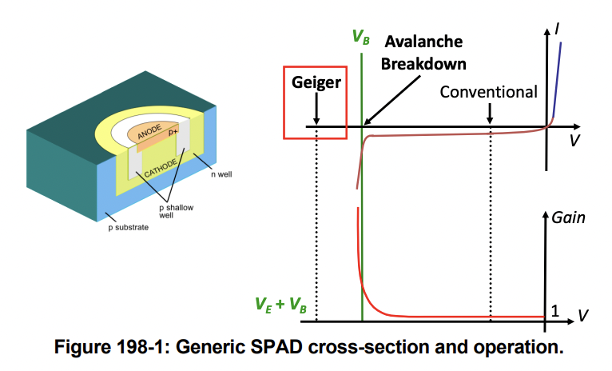

The VL53L4CX Time-of-Flight Sensor houses an array of SPADS, utilizing their photodetecting abilities to extract measurements of surrounding terrain (@clark_vl53l4cx).

Thus, despite challenges, a number of relevant physical factors highlight how ToF sensors can effectively scan terrain in scientific applications, providing inspiration and a rationale for the PicoScope Project.

### Logical Structure

The logical structure of this project consisted of the development of a few key components, namely the mechanical assembly of the ToF structure, software and hardware logic for interfacing with the sensor and stepper motor, development of the user experience, and graphics for visualizing sensor data/measurements.

Initially software logic for interfacing with the stepper motor via PIO state machines and with the ToF sensor were developed. Using the list of MACROs and functions provided in ECE4760's motor_library.h file, the direction and pace of the motor was continuously updated via an interrupt service routine. Because the interrupt handler was called after the stepper motor executed a command, it was also a suitable function for processing the distance measurements produced by the ToF sensor.

Extraction of ToF sensor measurements on the VL53L5CX was achieved by adapting Arduino libraries for the sensor. These libraries allowed for the extraction of distance and signal strength measurements. Originally, an attempt was made to adapt the relevant functions of the libraries to make them compatible with the RP2040. Ideally, only the I2C Read and Write functions in the library would have had to be modified to allow for compatibility of all other Arduino functions with the Pico. However, it was determined that the call-stack of the relevant Arduino functions were too complex and the process of modifying the relevant functions would be too laborious. A superior solution included the integration of an Arduino DUE into our hardware setup. Measurements from the ToF sensor were ultimately extracted by the Arduino DUE and transported to the RP2040 via UART communication protocol.

These two software components formed a strong base for the PicoScope. The pin-out diagram of the sensor below illustrates the hardware interface (SCL and SDA) that allows for the I2C communication with the Arduino DUE [@charbon_spad]:

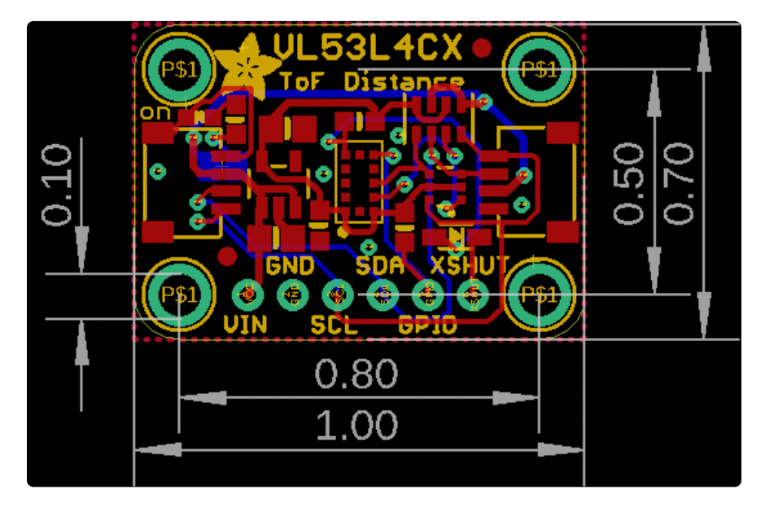

Additionally, the mechanical structure of the PicoScope was constructed to achieve accurate and stable measurements. A coupler was connected to a stepper motor, and an 8mm shaft connected the coupler to a mount for the ToF sensor - this structure rotated the ToF sensor to complete 2-D scans of the surrounding terrain. Additionally, a lego structure housed the system providing extra stability.

Moreover, an optical interrupter was integrated into the mechanical design to act as a reference point for the sensor's angle. The angles of all distance and signal rate measurements were reported relative to this reference point. Below are images of the mechanical assembly:

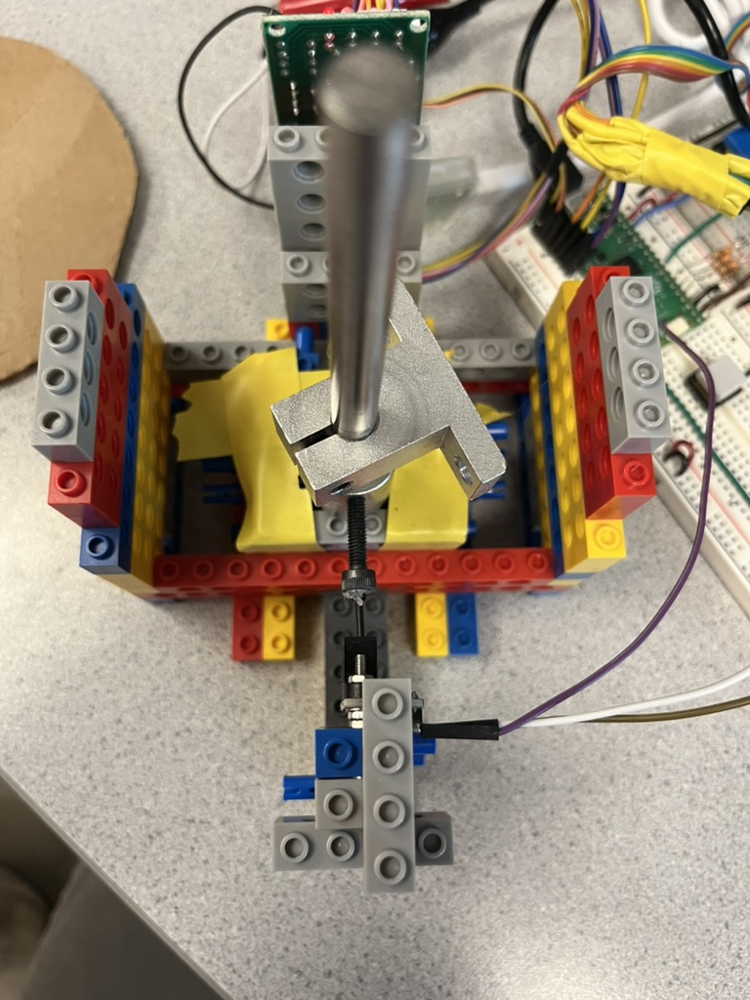

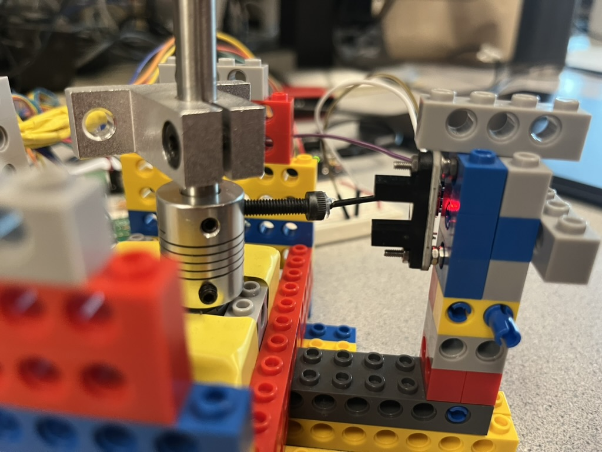

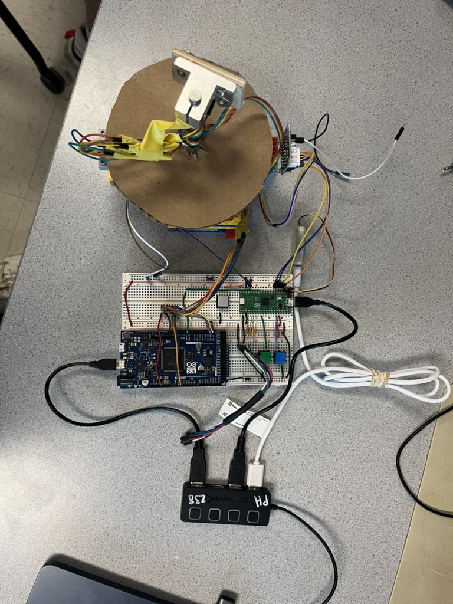

In addition to the above software and hardware components, user-experience was a major component of this project. Three buttons allowed for easy user control over the ToF sensor. Most notably, a state button was utilized to control and calibrate the ToF and initiate scanning. Moreover, the optical interrupter functioned as a "button"; it was triggered when the ToF moved into the correct position. A reset/clear screen button was implemented to reset the ToF measurements, and an emergency motor stop button was implemented for safety purposes (e.g., to stop the motor on command).

Lastly, VGA graphics were implemented to display the ToF measurements. Concentric circles were drawn on the VGA to indicate readable distance measurements, and a bar was drawn to display signal rate measurements. Distance measurements from the ToF sensor were reported in mm while signal rate, which measures the intensity of the signal received by the sensor from its reflected photons, was reported in milli-Mega Counts per Second (@KVAM_2019). Each photon received by the sensor is a count for this measurement (@KVAM_2019). Interestingly, graphical depictions of both measurements highlighted a correlation between accuracy and increased signal rate. Below are images displaying the graphical VGA displays of our ToF setup:


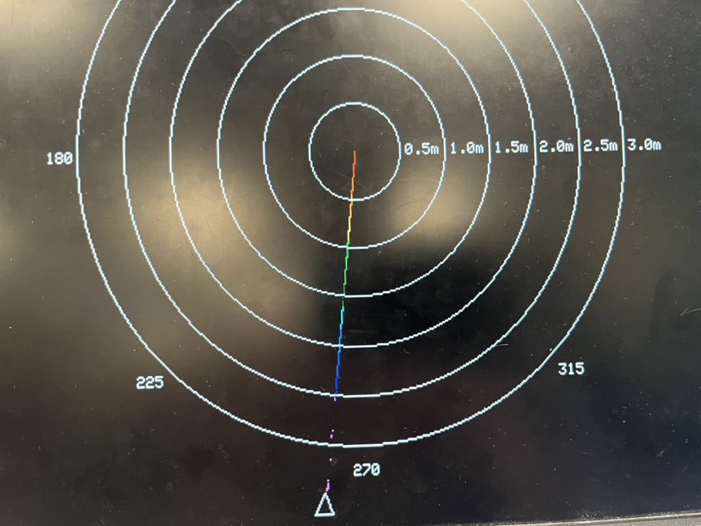


Thus, the project consisted of multiple hardware and software components. All components were combined to form a high-functioning ToF system.

### Hardware/Software Tradeoffs

There were a few hardware/software tradeoffs present in the project. One initial difficulty included providing compatibility between the ToF sensor's software library and the RP2040. The ToF sensor's software library was designed only for Arduino; as such, all relevant functions would need to be modified to allow for use with the RP2040. At first it seemed that modifyig the I2C Read and Write functions would adapt all functions so that they could be used with the RP2040; however, further investigation of the library indicated that this process would be too difficult. Therefore, instead of attempting to alter the software to provide RP2040 functionality, an Arduino DUE was integrated into the hardware setup. The Arduino DUE directly extracted measurements from the sensor and communicated them to the RP2040 via UART communication protocol. Thus, the hardware modification eliminated software difficulties caused by the sensor's software library.

Moreover, button debouncing comprised an additional HW/SW tradeoff for the project. Button debouncing was implemented via software - a state machine for checking button presses was coded in C. However, it is possible to implement the same functionality using hardware components. For example, an RC circuit can be used for button debouncing. The circuit, which consists of resistors, a capacitor, a switch and contacts to power and ground, can help to filter the vibrations and bouncing that can occur during a button press [@ganssle_debouncing]. This hardware would have simplified the code in this project. Alternatively, software logic for button debouncing helped to simplify the hardware set-up, indicating another HW/SW tradeoff.

---

## Program/Hardware Design

Discuss tricky parts, hardware, and software choices.

### Hardware Schematic

 schematic of our breadboard](schematic_hard.png)

### Software Schematic

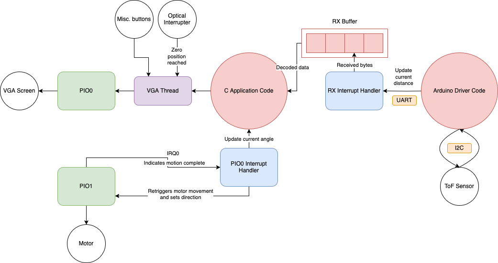

### Graphics

Graphics for displaying the state of the ToF sensor were implemented via a VGA. The program consisted of three screen states:

1. a home screen for displaying an introduction to the user

2. a prompt screen asking the user to push a button, initiating ToF scanning

3. a scan screen for displaying the ToF sensor's realtime measurements

| Home Screen                     | Prompt Screen                       | Scan Screen                     |
|---------------------------------|-------------------------------------|---------------------------------|
|  | 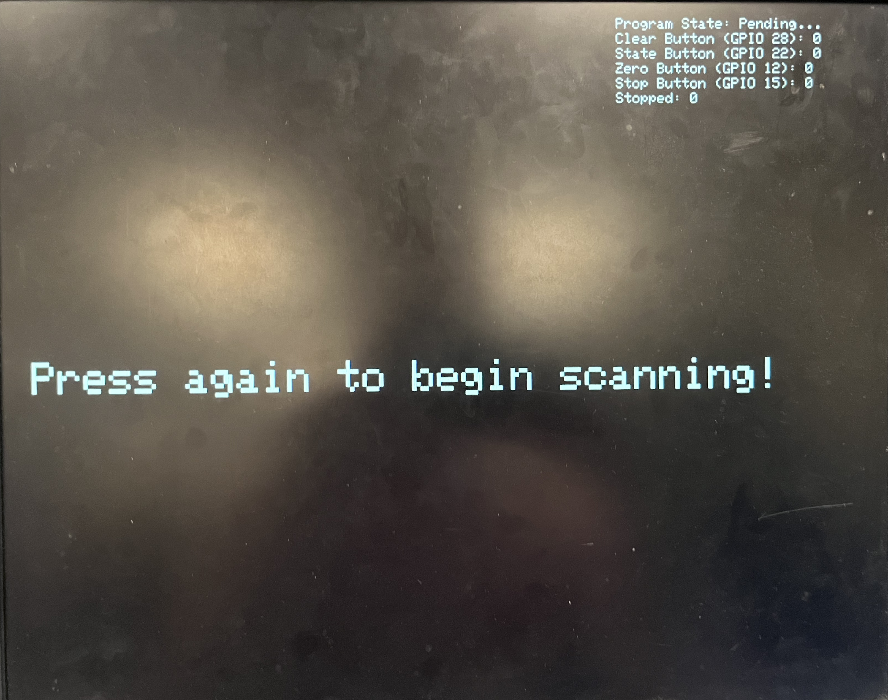 |  |


In addition to these states, the VGA could be cleared by the user at any point during sensor operation. While scanning terrain, the VGA communicated various measurements extracted from the sensor. The VGA display showed real-time 2D distance measurements at the correct scale as well as real-time signal strength measurements. To ensure accurate representation of the measurements, the current angle of the sensor was displayed, and concentric circles were utilized to label the distances of the objects in the immediate vicinity of the ToF sensor. The descriptions below go into further detail about the graphics rendered for the project.

- FSM / some description of different screens and modes


#### Converting Polar Measurements to Screen Positions

As the stepper motor rotates the ToF sensor, it provides the current angle of the sensor, while the ToF sensor measures the distance to the nearest object in that direction. Together, these form polar coordinates (`dist`, `angle`) that need to be converted into 2D coordinates (`x_pixel`, `y_pixel`) to show on the VGA display. The x position is calculated from the cosine of the angle, and the y from the sine. Because screen coordinates define increasing y as downward, we subtract the vertical offset to preserve the expected spatial orientation. This (x, y) position represents the detected point in space and is drawn to the screen using a color that reflects its distance.

```c
int x_pixel = CENTER_X + (int) (dist * PX_PER_MM * cos(angle));
int y_pixel = CENTER_Y - (int) (dist * PX_PER_MM * sin(angle));
char color = map_to_color(dist, 0, max_mm);
drawPixel(x_pixel, y_pixel, color);
```

#### Color Map

To make the polar grid visually convey distance more intuitively, we designed it so that points are colored along a rainbow gradient, starting from red at the closest distances and transitioning through shades of orange, yellow, green, blue, and finally pink at the farthest distances. This color progression allows viewers to quickly interpret relative distance based on color alone. Although `vga16_graphics.h` provides a predefined enum `colors`, its ordering is not aligned with a rainbow ordering, placing greens and blues before reds and yellows. Consequently, if we simply looped through the enum values in order, the resulting colors would jump around; this motivated the creation of `rainbow_colors`, a custom array of 14 colors (excluding `WHITE` and `BLACK` from the 16 VGA colors) arranged to represent a rainbow gradient. The function `map_to_color` then maps a value (distance) to the appropriate color. It linearly scales the input value between a min_val and max_val (in our case, `0` and `max_mm=3000`) to an index from 0 to 13, which selects the corresponding color from the array. This approach ensures smooth color transitions across the grid and makes it easy to map different data ranges by adjusting `min_val` and `max_val` without modifying `rainbow_colors`.

```c
const char rainbow_colors[14] = {RED, DARK_ORANGE, ORANGE, YELLOW,
  GREEN, MED_GREEN, DARK_GREEN,
  CYAN, LIGHT_BLUE, BLUE, DARK_BLUE,
  MAGENTA, PINK, LIGHT_PINK} ;

char map_to_color_index(int value, int min_val, int max_val) {
    if (value <= min_val) return 0;
    if (value >= max_val) return 13;

    return rainbow_colors[(value - min_val) * 13 / (max_val - min_val)];
}
```

#### Images

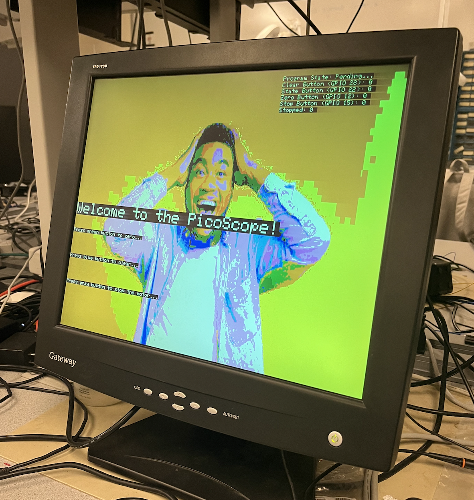


To display custom images on the VGA output, we created a Python toolchain to convert regular images into a C array that matches the 16-color VGA palette. This approach allowed us to prepare image assets offline and store them in a format that could be directly used with our graphics rendering code.
Image Conversion Workflow

We used Python with the [`Pillow`](https://pypi.org/project/pillow/) and [`numpy`](https://numpy.org/) libraries to process the image:

1. Resize the image to the VGA resolution of `160 x 120`
2. Quantize the image colors to the 16-color VGA palette
3. Convert the pixel data into a flat C array for use in our embedded code

This script outputs a .c file with the image data, which we can include in our project. For example

```c
#define IMAGE_WIDTH 160
#define IMAGE_HEIGHT 120
const unsigned char image_data[IMAGE_WIDTH * IMAGE_HEIGHT] = {
    // image pixel indices here...
};
```

To draw this array onto the screen, we used a simple helper function:

```c
// #include "vga16_graphics.h"

void drawImage(short x0, short y0, short width, short height, const unsigned char *image)
{
    for (short y = 0; y < height; y++) {
        for (short x = 0; x < width; x++) {
            char color = image[y * width + x];
            drawPixel(x0 + x, y0 + y, color);
        }
    }
}
```

#### Signal Bar

To display the current signal rate in mMCPS, a bar was displayed in the upper left corner of the VGA. The mMCPS, as described previously, represents the signal rate, or number of photons hitting the sensor (@clark_vl53l4cx). To draw the bar, the background of the bar was drawn in black so as to ensure a constant bar size regardless of the current signal measurement. Then, the bar's length was computed based upon the current signal rate such that bar length = (current signal/max allowed signal) * bar width.

After experimenting with the graphical display, it was determined that the VGA drawing was too noisy due to instability in signal rate measurement. To remedy this issue, the current signal was updated once every 25 UART data transfers and assigned to the running sum of the past 25 extracted signal rate measurements. This allowed for less noisy (filtered) mMCPS measurements.

Interestingly, the correlation between signal strength and quality of distance measurement was graphically displayed - higher quality/more accurate measurements corresponded with larger values in the signal bar.

#### Polar Grid

To improve spatial orientation and help users interpret both distance from the ToF sensor and direction relative to the zero gate, we overlaid a polar grid on the display. The grid includes concentric rings that represent increasing radial distances from the ToF sensor (center of the plot), and angle labels placed every 45° around the outermost ring to indicate direction. Because the zero gate defines the 0° direction, all angle measurements are shown relative to that baseline, making it easier to understand the spatial position of each point in the scene.

#### Angle Arrow

To indicate the current orientation of the ToF sensor relative to the zero gate, we added a triangular arrow that orbits just beyond the outermost distance ring of the polar grid, pointing toward the center. As the ToF sensor rotates through angles, the arrow moves smoothly around the circle, providing a clear and continuous indication of the sensor's current direction. Initially, we computed the arrow's position using radian-based (floating-point) `sin()` and `cos()` calls each frame, but this introduced noticeable lag, occasionally causing the pointer to skip nearly 20° between updates. To resolve this, we precomputed sine and cosine values for all 360 degrees and scaled each value by a constant factor (SCALE = 1024) so the values can be stored as `int`s in lookup tables. Using these, we constructed the triangle with basic vector geometry: its tip points along the current angle, and its base is centered perpendicular to that direction. The coordinates of the triangle's vertices are calculated from the scaled trig values and rendered using three lines, resulting in a lightweight visual marker of the real-time sweep of the sensor.

##### Volatile Variables

One of the challenges we encountered while rendering the data was dealing with volatile variables. A particularly tricky issue arose in the code snippet below:

```c
drawTrianglePointerOutline((int) RAD2DEG(current_angle), max_mm * PX_PER_MM, BLACK);
drawTrianglePointerOutline((int) RAD2DEG(current_angle), max_mm * PX_PER_MM, WHITE);
```

These lines are responsible for drawing the triangle which indicates the current LiDAR angle. At first glance, this code appears fine. However, we observed frequent flickering—sometimes the triangle wasn't fully erased, leading to inconsistent visual behavior. The randomness of this issue suggested that interrupts were affecting the value of `current_angle` between the two drawing calls.

The root cause was that `current_angle` is a volatile variable that may be modified by an interrupt at any time. As a result, the value could change between the two calls to `drawTrianglePointerOutline()`, causing the triangle to be drawn and erased at different angles. To solve this, we cached the computed value before using it, ensuring consistency:

```c
float angle_deg = RAD2DEG(current_angle);
drawTrianglePointerOutline((int) angle_deg, max_mm * PX_PER_MM, BLACK);
drawTrianglePointerOutline((int) angle_deg, max_mm * PX_PER_MM, WHITE);
```

By storing the result of `current_angle` in a temporary variable, we guaranteed that both calls used the exact same angle, eliminating flicker and improving rendering stability.

### Mechanical Assembly

One of the most challenging parts of this lab was the actual mechanical assembly. This biggest challenge is that we have a rotating structure--and wires and twisting do not generally mix very well. The most obvious solution
would be to use a slip ring connector, but these can be rather pricey ($25-40!).

Instead, we designed our LiDAR to only rotate 360° before reversing direction. In this fashion, we avoided overly twisting the wires, but still maintained a full 360° FOV. To build the device, we fixed a small stepper motor to a base built with LEGOs. We choose LEGOs as they were accessible, flexible, and easy to work with. Then, we fixed a four inch 8 mm shaft to the motor using a small coupler. From there, we fixed a linear mount to the shaft, and fixed the ToF sensor onto that. In order to wire the LiDAR to the Arduino Due, we used a ribbon cable with jumper wires soldered onto either end. This choice in wire was critical, as the normal solid core wires were far too stiff to permit the motion we required.

Even given this more flexible cable, things would still frequently get tied up. If we were to attempt a second prototype, we would mount the whole system on a rotating platform. This way, all sensitive electronic connections would be stationary relative to each other, and a slip ring delivering ground and power could be connected.

To zero the motor (to define a set zero angle), we mounted an optical interrupter to the LEGO base. To trigger it, we used one of the M4 threads in the coupler to fix a larger M4 bolt. On the head of the bolt, we hot glued a GPIO header to serve as a more precise way to block the [optical interrupter](https://www.rohm.com/electronics-basics/photointerrupters/what-is-a-photointerrupter). We found the header alone was not sufficient, so we place some of te PVC wire coating around the header, and this was sufficient to accurately and precisely zero the motor. Interesting, we found that the zeroing was too bouncy to start, thus, we found we needed to debounce the interrupter to get a reliable reading. To do this, we simply used the same debouncing code as the other buttons, and effectively treated the interrupter as a button.

### Generalized Button Code

Since we required multiple buttons for a design, we refactored the debouncing code of prior labs to make the code easier to reuse. We define a `Button` struct to hold all data pertinent to debouncing and firing a specific button.

```c
typedef struct
{
    uint gpio;
    ButtonState state;
    void (*on_press)(void);     // Function on press
    void (*on_release)(void);   // Function on release
} Button;
```

We then updated the debouncing function to take one of these structures:

```c
/* Debounce button press
 */
void check_button(Button *button)
{
    bool button_reading = gpio_get(button->gpio);

    switch (button->state) {
        case NOT_PRESSED:
            if (button_reading == 0) {
                button->state = MAYBE_PRESSED;
            }
            break;

        case MAYBE_PRESSED:
            if (button_reading == 0) {
                button->state = PRESSED;

                // Press function
                if (button->on_press) {
                    button->on_press();
                }

            } else {
                button->state = NOT_PRESSED;
            }
            break;

        case PRESSED:
            if (button_reading == 1) {
                button->state = MAYBE_NOT_PRESSED;
            }
            break;

        case MAYBE_NOT_PRESSED:
            if (button_reading == 0) {
                button->state = PRESSED;
            } else {
                button->state = NOT_PRESSED;

                // Release function
                if (button->on_release) {
                    button->on_release();
                }
            }
            break;

        default:
            button->state = NOT_PRESSED;
    }
}
```

Thus, adding additional buttons became a breeze, as all we needed to do was define a struct and the `on_press` and/or the `on_release` functions. For example, here the code to treat the optical interrupter (called "zero gate" here) as a button:

```c
void zero_gate_on_block(void) {
    zeroed = true;
}
Button zero_gate = {
    .gpio = ZERO_GATE_PIN,
    .state = NOT_PRESSED,
    .on_press = zero_gate_on_block,
    .on_release = NULL,
};
```

All the buttons are then debounced at the top of the loop in the VGA thread:

```c
while (true) {

    check_button(&clear_button);
    check_button(&state_button);
    check_button(&zero_gate);
    check_button(&stop_button);

    // Drawing logic
    // ...
}
```

A yield of three milliseconds proved sufficient to debounce the mechanical buttons without noticeably impacting overall system responsiveness.

### States

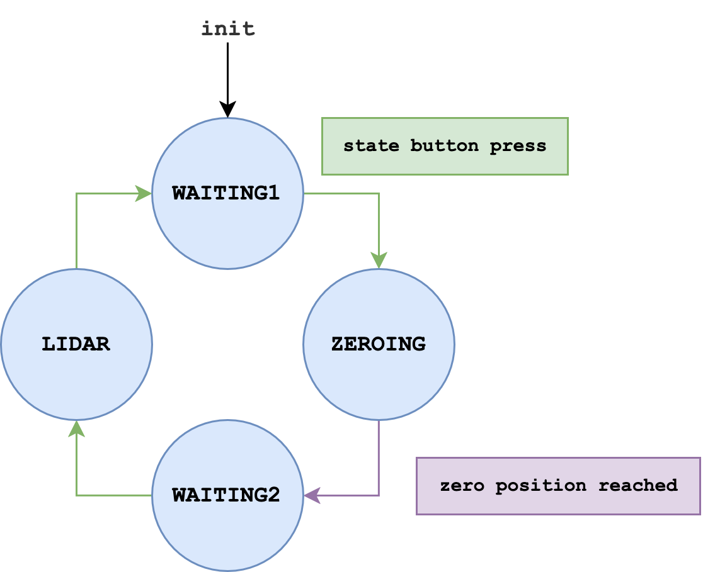

The program operates as a finite state machine to manage the LiDAR system's behavior based on user input. It begins in the `WAITING1` state, during which the system is idle and allows for [sensor calibration](#vl53l4cx-accuracy). If the user holds a the green state button, the system transitions to the `ZEROING` state, which is responsible for aligning the stepper motor with the zero position via the optical interrupter.

Once the zero position is reach, the system automatically enters the `WAITING2` state, signaling readiness to begin data collection. When the user presses the button again, the program transitions to the `LIDAR` state, actively rotating the motor and collecting distance data from the ToF sensor. Pressing the button once more returns the system to the initial `WAITING1` state, completing the control loop.

To display an boot screen, we added a boolean flag, which when true, will display the an [image](#images) and instructions during the `WAITING1` state. After the initial boot, the flag is set to false and all further `WAITING1` states do not display the boot screen.

---

## Results of the Design

Data, results, scope traces, etc.

### Zeroing Mechanism

When the wiring was free and unobstructed, the stepper motor avoided over-torquing and consistently returned accurately to the zero position. Zeroing worked reliably throughout testing.

<figure>
    <video width="640" height="480" controls>
    <source src="zeroing_top.mp4" type="video/mp4">
    Your browser does not support the video tag.
    </video>
      <figcaption>Top-down view of stepper motor zeroing.</figcaption>
</figure>

<figure>
    <video width="640" height="480" controls>
    <source src="zeroing_side.mp4" type="video/mp4">
    Your browser does not support the video tag.
    </video>
      <figcaption>A side view of the of zeroing mechanism.</figcaption>
</figure>

### VL53L4CX Accuracy

| Actual Object Distance (mm) | Reported Distance  |
| --------------------------- | ------------------------------------- |
| 0                           | ~0                                    |
| 50                          | 49                                    |
| 500                         | 501                                   |
| 1000                        | 1002                                  |

The ToF sensor demonstrated excellent precision and repeatability. The small discrepancies seen in the distance measurements (e.g., 49 mm vs. 50 mm) were primarily due to limitations in our testing setup, not the sensor itself. For reference, we used a meter stick and placed a piece of wood above it to align target distances. This method introduced small alignment and parallax errors, especially at longer distances. Despite this, the reported measurements were remarkably close to the actual values, confirming the sensor's accuracy. With a more controlled calibration environment (e.g., laser-aligned setup or fixed mounts), we would have observed even greater accuracy.

The VL53L4CX also supports advanced features such as smudge correction, signal threshold tuning, and multi-zone detection, which we did not fully utilize in this project (for instance, adding smudge correction did not result in any observable difference in our scans). There was also a setting that permitted the user to calibrate the sensor using a fixed, known distance. This could have been used during the [`WAITING1`](#states) state.

### Scans

While the VL53L4CX sensor is well-suited for measuring slow-moving objects, large sudden jumps in distance can cause inaccurate readings, resulting in poor scan quality. Additionally, the maximum report rate of about 8 ms per measurement is not fast enough for extremely precise scans. Furthermore, movement from the stepper motor and wire tugging introduced additional noise into the measurements, affecting overall scan reliability.

<figure>
    <video width="640" height="480" controls>
    <source src="scan.mp4" type="video/mp4">
    Your browser does not support the video tag.
    </video>
      <figcaption>Example of a scan being collected.</figcaption>
</figure>

We also set up a test environment to demonstrate the scan’s effectiveness. By placing a large piece of wood next to the sensor, we showed that it reliably appears in the scan output (see the following image).

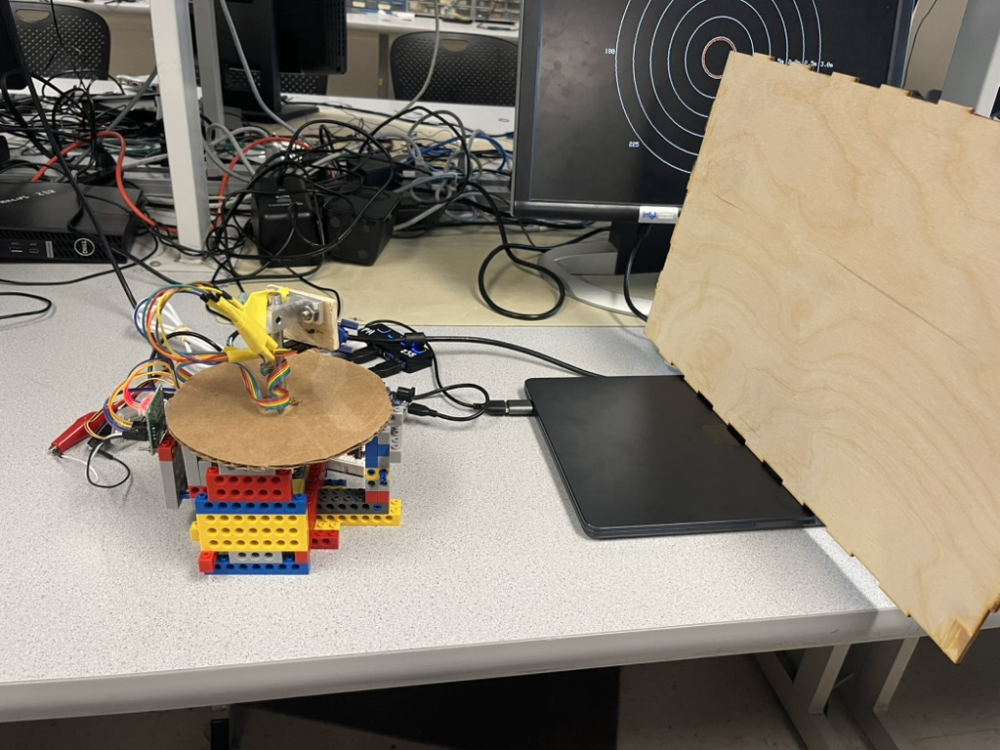

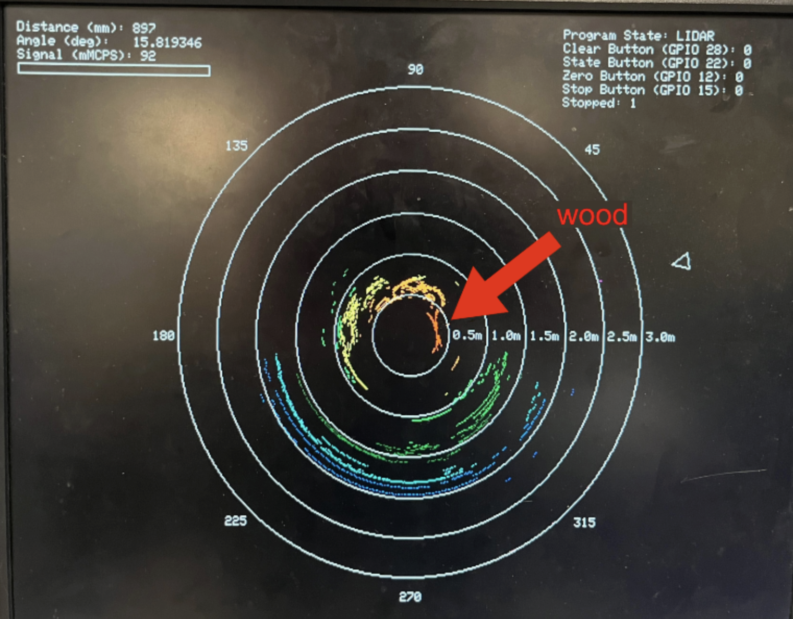

## Conclusions

Analyze your results and discuss improvements.

TODO: add more than just on mechanics!
- Note that DMA and FIFO for uart was broke :/
- Note that GPIO 15 would trigger 22 :/

Our 2D LiDAR system achieved its primary goal of capturing rotational distance measurements using a Raspberry Pi Pico, a ToF sensor, and a stepper motor. The implementation was successful in demonstrating the core functionality of a low-cost scanning system capable of mapping its surroundings in real-time.

One of the most significant engineering challenges we faced was the mechanical assembly, particularly the issue of wire entanglement during rotation. By designing the system to sweep back and forth over 360°, we avoided the need for an expensive slip ring while still maintaining full angular coverage. However, this introduced complexity in cable management and occasional interference, even when using a flexible ribbon cable. A future improvement would be to mount the entire sensor on a rotating platform, isolating electronic components from moving parts and allowing a slip ring to only carry power and ground.

The use of LEGOs as the structural framework provided a convenient and adaptable platform, but a custom 3D-printed or machined chassis would offer greater precision, durability, and compactness. Additionally, our zeroing mechanism using an optical interrupter worked well after incorporating debouncing, though it required careful alignment and tuning. Integrating a mechanical end-stop or magnetic encoder could provide a more robust and repeatable zeroing process.

We also observed that the VL53L4CX sensor appears to be optimized more for high-accuracy measurements rather than performance in dynamic or high-speed environments like LiDAR scanning. While it delivers precise distance readings under static or slow-moving conditions, its update rate and timing constraints limited how fast we could reliably rotate the sensor and still obtain accurate readings. A sensor designed specifically for fast time-of-flight sampling in motion could significantly improve the responsiveness and resolution of our system.

Similarly, the small 28BYJ-48 stepper motor, while cost-effective and easy to control, imposed limitations on scan speed and torque. Its relatively low speed made high-resolution scans time-consuming, and its low torque occasionally caused missed steps or jitter. Replacing it with a larger stepper motor or even a continuous-rotation servo could drastically improve angular velocity and positional stability, enabling smoother and faster scans. A motor with built-in position feedback (like a servo or closed-loop stepper) would further enhance precision and eliminate the need for separate zeroing hardware.

Overall, our project demonstrated a functional and extensible LiDAR system that could serve as the foundation for further development, including real-time mapping, obstacle detection, or autonomous navigation. With minor refinements in mechanical design and electrical isolation, the system's performance, accuracy, and reliability could be significantly improved.

## Appendix A

The group does not approve this report for inclusion on the course website.

The group does not approve the video for inclusion on the course YouTube channel.

© 2025 Mac Marsh (mpm297) ∙ Dalton Luce (dcl252) ∙ Arnav Muthiayen (am2589) — Cornell University

# References
